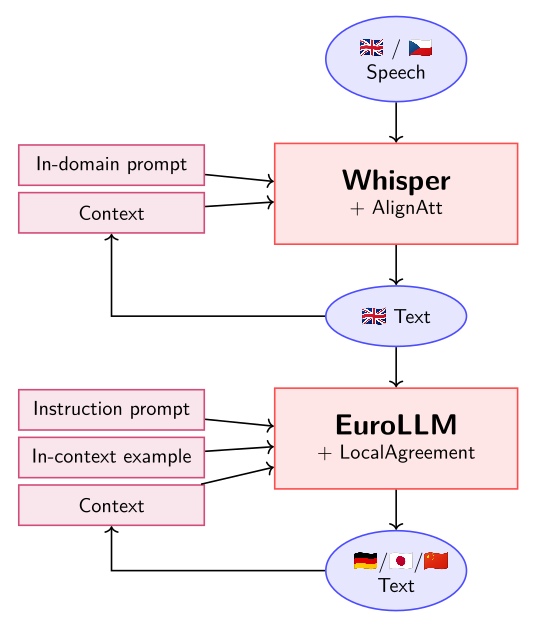

# SimulStreaming

SimulStreaming is a tool for simultaneous (aka streaming) processing of speech-to-text and LLM translation models. 

✨ Key features:
- 🌐 Multilingual: 99 Whisper source languages → 35 EuroLLM target languages.
- 📝 Translation + ASR.
- ⚡ Real-time and faster than ever: ~5-times faster than our previous release called WhisperStreaming, thanks to efficient simultaneous policy.
- 🧩 Flexible prompting & context: Supports in-domain terminology and retrieval augmented generation (RAG).
- 🎯 High quality: Simultaneous use of strong foundation models with little performance loss.
- 🔧 Simple & robust: Clean middleware design – server with mic input or file simulation.
- 💻 Feasible hardware: Optimized for 1–2 GPUs (Whisper large-v3 1.5B + EuroLLM 9B), but possible with smaller distilled models.
- 🚀🔬 For production and research: designed to process authentic long-form speech. 
- 🏆 State of the art 2025: the best-performing in IWSLT 2025 Simultaneous Speech Translation Shared Task.

SimulStreaming supports:
- **direct speech-to-text** using Whisper for translation from 99 into English, or for transcription in these languages.
- **cascade** of Whisper speech-to-text + EuroLLM text-to-text translation, for 35 target languages.

This diagram shows 4 example language directions that were used in IWSLT 2025. In fact, there are many more:

<p align="center">
    
</p>


SimulStreaming implements Whisper model for translation and transcription in
simultaneous mode (which is known as *streaming* in the ASR community).
SimulStreaming uses the state-of-the-art simultaneous policy AlignAtt, which
makes it very fast and efficient.

SimulStreaming merges [Simul-Whisper](https://github.com/backspacetg/simul_whisper/) and [Whisper-Streaming](https://github.com/ufal/whisper_streaming) projects.
Simul-Whisper implemented AlignAtt with Whisper, but only using large-v2 model
for transcription. We extend it with support for translation and large-v3 model, and with beam search, prompt for injecting in-domain
terminology, and context across the 30-second processing windows. Moreover,
Simul-Whisper implements only less realistic simulation on sentence-segmented
speech. Therefore, we use the interface of Whisper-Streaming for the long-form input
simulation, both computationally unaware and aware, and from both audio file and
simple demo TCP server that can be connected to microphone.

Moreover, SimulStreaming adds a machine translation model EuroLLM in a cascade, with LocalAgreement simultaneous policy, system
prompt, and in-context example.

SimulStreaming originates as [Charles University (CUNI) submission to the IWSLT
2025 Simultaneous Shared Task](https://arxiv.org/abs/2506.17077). The results show that this system is extremely robust
and high quality. It is among the top performing systems in IWSLT 2025
Simultaneous Shared Task.

## Usage

SimulStreaming has two components: 

- 1. Whisper speech-to-text -- in `simulstreaming/whisper`
- 2. LLM text-to-text translation  -- in `simulstreaming/translate`

Any of these components can be installed and used independently on the other, e.g. in two HW environments, but 2. expects source from 1. 

The only code used by both components are `simulstreaming/utils`. There are server utils that don't need to be installed. 

### 1. Whisper speech-to-text

#### Installation

```bash
pip install -r requirements_whisper.txt
```
**Lighter installation**

For slightly lighter installation, remove `torchaudio`. Then you can not use the Silero VAD controller (`--vac` option).

#### Dependencies

**SW:**

The comments in `requirements_whisper.txt` document the origin of SW dependencies. Code from three projects was copied, modified and included in this repo:
- [WhisperStreaming](https://github.com/ufal/whisper_streaming): in `simulstreaming/whisper/whisper_streaming` dir. It is simplified and refactored. This project uses WhisperStreaming's interface of server and simulation from file, and Voice Activity Controller that detects and skips unvoiced segments of audio.   
- [Simul-Whisper](https://github.com/backspacetg/simul_whisper): in `simulstreaming/whisper/simul_whisper`. It was refactored and extended with new features such as support of Whisper large-v3 model, beam decoding, translation and not only transcription. 
- [OpenAI Whisper](https://github.com/openai/whisper): code adapted for Simul-Whisper in `simulstreaming/whisper/simul_whisper/whisper`. It uses `torch` as deep learning computation framework.

**HW:**

Recommended HW is GPU with at least 10G VRAM, to run the best-performing Whisper model large-v3 with 1.5B parameters. The code works also on CPU but would be too slow for real-time.

#### Usage: Real-time simulation from audio file


```
$ python3 simulstreaming_whisper.py -h
usage: simulstreaming_whisper.py [-h] [--min-chunk-size MIN_CHUNK_SIZE] [--lan LAN] [--task {transcribe,translate}] [--vac] [--vac-chunk-size VAC_CHUNK_SIZE]
                                 [-l {DEBUG,INFO,WARNING,ERROR,CRITICAL}] [--logdir LOGDIR] [--out-txt] [--model_path MODEL_PATH] [--beams BEAMS] [--decoder DECODER]
                                 [--audio_max_len AUDIO_MAX_LEN] [--audio_min_len AUDIO_MIN_LEN] [--frame_threshold FRAME_THRESHOLD] [--cif_ckpt_path CIF_CKPT_PATH]
                                 [--never_fire | --no-never_fire] [--init_prompt INIT_PROMPT] [--static_init_prompt STATIC_INIT_PROMPT] [--max_context_tokens MAX_CONTEXT_TOKENS]
                                 [--start_at START_AT] [--comp_unaware]
                                 audio_path

options:
  -h, --help            show this help message and exit
  -l {DEBUG,INFO,WARNING,ERROR,CRITICAL}, --log-level {DEBUG,INFO,WARNING,ERROR,CRITICAL}
                        Set the log level
  --logdir LOGDIR       Directory to save audio segments and generated texts for debugging.
  --out-txt             Output formatted as not as jsonl but simple space-separated text: beg, end, text

WhisperStreaming processor arguments (shared for simulation from file and for the server):
  --min-chunk-size MIN_CHUNK_SIZE
                        Minimum audio chunk size in seconds. It waits up to this time to do processing. If the processing takes shorter time, it waits, otherwise it processes the whole
                        segment that was received by this time.
  --lan LAN, --language LAN
                        Source language code, e.g. en, de, cs, or auto for automatic language detection from speech.
  --task {transcribe,translate}
                        Transcribe or translate.
  --vac                 Use VAC = voice activity controller. Recommended. Requires torch.
  --vac-chunk-size VAC_CHUNK_SIZE
                        VAC sample size in seconds.

Whisper arguments:
  --model_path MODEL_PATH
                        The file path to the Whisper .pt model. If not present on the filesystem, the model is downloaded automatically.
  --beams BEAMS, -b BEAMS
                        Number of beams for beam search decoding. If 1, GreedyDecoder is used.
  --decoder DECODER     Override automatic selection of beam or greedy decoder. If beams > 1 and greedy: invalid.

Audio buffer:
  --audio_max_len AUDIO_MAX_LEN
                        Max length of the audio buffer, in seconds.
  --audio_min_len AUDIO_MIN_LEN
                        Skip processing if the audio buffer is shorter than this length, in seconds. Useful when the --min-chunk-size is small.

AlignAtt argument:
  --frame_threshold FRAME_THRESHOLD
                        Threshold for the attention-guided decoding. The AlignAtt policy will decode only until this number of frames from the end of audio. In frames: one frame is 0.02
                        seconds for large-v3 model.

Truncation of the last decoded word (from Simul-Whisper):
  --cif_ckpt_path CIF_CKPT_PATH
                        The file path to the Simul-Whisper's CIF model checkpoint that detects whether there isend of word at the end of the chunk. If not, the last decoded space-
                        separated word is truncated because it is often wrong -- transcribing a word in the middle.The CIF model adapted for the Whisper model version should be used. Find
                        the models in https://github.com/backspacetg/simul_whisper/tree/main/cif_models . Note that there is no model for large-v3.
  --never_fire, --no-never_fire
                        Override the CIF model. If True, the last word is NEVER truncated, no matter what the CIF model detects. . If False: if CIF model path is set, the last word is
                        SOMETIMES truncated, depending on the CIF detection. Otherwise, if the CIF model path is not set, the last word is ALWAYS trimmed. (default: False)

Prompt and context:
  --init_prompt INIT_PROMPT
                        Init prompt for the model. It should be in the target language.
  --static_init_prompt STATIC_INIT_PROMPT
                        Do not scroll over this text. It can contain terminology that should be relevant over all document.
  --max_context_tokens MAX_CONTEXT_TOKENS
                        Max context tokens for the model. Default is 0.

Arguments for simulation from file:
  audio_path            Filename of 16kHz mono channel wav, on which live streaming is simulated.
  --start_at START_AT   Start processing audio at this time.
  --comp_unaware        Computationally unaware simulation.
```

**Example:**

```
python3 simulstreaming_whisper.py audio.wav --language en --task transcribe --comp_unaware --vac
```

**Simulation modes:**

- default mode, no special option: real-time simulation from file, computationally aware. The chunk size is `MIN_CHUNK_SIZE` or larger, if more audio arrived during last update computation.

- `--comp_unaware` option: computationally unaware simulation. It means that the timer that counts the emission times "stops" when the model is computing. The chunk size is always `MIN_CHUNK_SIZE`. The latency is caused only by the model being unable to confirm the output, e.g. because of language ambiguity etc., and not because of slow hardware or suboptimal implementation. We implement this feature for finding the lower bound for latency.

- `--start_at START_AT`: Start processing audio at this time. The first update receives the whole audio by `START_AT`. It is useful for debugging, e.g. when we observe a bug in a specific time in audio file, and want to reproduce it quickly, without long waiting.

- offline mode, to process whole audio with maximum quality, is not available yet. Instead, try large `--min-chunk-size` and `--frame-threshold`.


**Output format:**

1) Default JSONL

Default stdout is jsonl. The command incrementally processes incoming audio chunks. After each chunk, there can be either:
- no output
- a line with partial text output, like

```
{"start": 0.332, "end": 0.832, "text": " And so,", "tokens": [400, 370, 11], "words": [{"start": 0.332, "end": 0.332, "text": " And", "tokens": [400]}, {"start": 0.532, "end": 0.532, "text": " so", "tokens": [370]}, {"start": 0.832, "end": 0.832, "text": ",", "tokens": [11]}], "is_final": false, "emission_time": 2.246028423309326}
```

- a line indicating end of voiced segment without any text update: 

```
{"is_final": true, "emission_time": 3.060192108154297}
```

Explanation of json fields:

```
{
  # start and end timestamps, in seconds, of a segment of the source audio where this partial output was detected by Whisper model. 
  # Warning: it may be inaccurate but good enough for some applications.
  "start": 0,  
  "end": 0.68,  


  # the partial text output produced in this update
  "text": " And so",  # the partial text output produced by this update
  "tokens": [  # list of token ids of text, used by Whisper tokenizer
    400,
    370
  ],

  # text segmented for more detailed word-level view
  "words": [  
    {
      "start": 0,  
      "end": 0,
      "text": " And",
      "tokens": [  
        400
      ]
    },
    {
      "start": 0.68,
      "end": 0.68,
      "text": " so",
      "tokens": [
        370
      ]
    }
  ],


  # a flag indicating end of voice at the end of segment in the original audio
  # this is used only with --vac option (Voice Activity Controller)
  "is_final": false,

  # simulation time, in seconds, when this line of output was produced
  # - in computational aware simulation: real time from the beginning of process  
  # - in computatational unaware simulation: length of incoming audio
  "emission_time": 1.9224984645843506
}
```

2. Simple text, with `--out-txt` option:

For back dependency, and for better eye-readable output for debugging, there is option for this format:

```
2246.5429 332 832  And so,
3468.0274 1032 1712  my fellow Americans
4637.6612 2172 3272 , ask
```

On each line, there are 3 space-delimited columns: 
- 1. emission time, in milliseconds
- 2.-3. start and end timestamps, in milliseconds

After these three columns, there is one space, and then the text. Notice that the text may start with a space, as the first line " And so,", or may not, as the 3rd line ", ask".

End of voice or word-level segments are not indicated in this format.

**Debug: Logdir**

With `--logdir LOGDIR` and `--vac` parameters, the tool will create a directory named LOGDIR. In this dir, there will be subdirectories for each voiced segment. Inside, for each chunk update, there will be: 
- an audio file with exact content of the audio buffer,
- text hypothesis file, containing the context, decoder text buffer used for forced decoding, and the hypothesis.

The file structure may look like this:

```
seg_00002:
iter_00001_audio.wav  iter_00001_hypothesis.txt

seg_00004:
iter_00002_audio.wav       iter_00003_audio.wav       iter_00004_audio.wav       iter_00005_audio.wav
iter_00002_hypothesis.txt  iter_00003_hypothesis.txt  iter_00004_hypothesis.txt  iter_00005_hypothesis.txt

...
```

The hypotheses files may contain:

```
==> seg_00002/iter_00001_hypothesis.txt <==
CONTEXT+FORCED:	<|startoftranscript|><|en|><|transcribe|><|notimestamps|>
HYPOTHESIS:	 And so

==> seg_00004/iter_00002_hypothesis.txt <==
CONTEXT+FORCED:	<|startoftranscript|><|en|><|transcribe|><|notimestamps|>
HYPOTHESIS:	 And so,

==> seg_00004/iter_00003_hypothesis.txt <==
CONTEXT+FORCED:	<|startoftranscript|><|en|><|transcribe|><|notimestamps|> And so,
HYPOTHESIS:	 my fellow Americans

==> seg_00004/iter_00004_hypothesis.txt <==
CONTEXT+FORCED:	<|startoftranscript|><|en|><|transcribe|><|notimestamps|> And so, my fellow Americans
HYPOTHESIS:	, ask

==> seg_00004/iter_00005_hypothesis.txt <==
CONTEXT+FORCED:	<|startoftranscript|><|en|><|transcribe|><|notimestamps|> And so, my fellow Americans, ask
HYPOTHESIS:	 not.
```

Note that the very first segment and hypothesis `seg_00002/iter_00001_hypothesis.txt` is from "warm-up" processing. Before beginning of each compuatationally aware simulation, the first 1 second is processed by model so that the following updates are faster.


### Usage: Server -- real-time from mic 

The entry point `simulstreaming_whisper_server.py` has the same model options as `simulstreaming_whisper.py`, plus:
- `--host` and `--port` of the TCP connection, 
- `--warmup-file`: the warmup audio file is decoded by the Whisper backend after the model is loaded because without that, processing of the very the first input chunk may take longer.

See the help message (`-h` option).

Only computationally aware simulation is available with server. The option `--out-txt` produces only 2 timestamps columns, the beginning and end timestamps in the input audio. Emission time is not available.

**Linux** client example:

```
arecord -f S16_LE -c1 -r 16000 -t raw -D default | nc localhost 43001
```

- `arecord` sends realtime audio from a sound device (e.g. mic), in raw audio format -- 16000 sampling rate, mono channel, S16_LE -- signed 16-bit integer low endian. (Or other operating systems, use another alternative)

- nc is netcat with server's host and port

**Windows/Mac**: `ffmpeg` may substitute `arecord`. Or use the solutions proposed in Whisper-Streaming pull requests [#111](https://github.com/ufal/whisper_streaming/pull/111) and [#123](https://github.com/ufal/whisper_streaming/pull/123).


### Usage: As a module

Analogically to using [WhisperStreaming as a module](https://github.com/ufal/whisper_streaming?tab=readme-ov-file#as-a-module).


## Translate with LLM

### Installation

First, install SW dependencies:

```
pip install -r requirements_translate.txt
```

Then, download an LLM model from Huggingface and convert it to CTranslate2.

Example for [EuroLLM-9B-Instruct](https://huggingface.co/utter-project/EuroLLM-9B-Instruct)
- Go to https://huggingface.co/utter-project/EuroLLM-9B-Instruct .
- It is a gated model. Sign in to hf.co and get access granted.
- Then, clone this model repository to a dir named `EuroLLM-9B-Instruct`. Use any of the ways suggested on HF webpage, e.g.:

```
# When prompted for a password, use an access token with write permissions.
# Generate one from your settings: https://huggingface.co/settings/tokens
git clone https://huggingface.co/utter-project/EuroLLM-9B-Instruct
```

Convert the HF model to CTranslate version that will be saved in `ct2_EuroLLM-9B-Instruct` dir:

```
pip install transformers[torch]  # suggested by https://opennmt.net/CTranslate2/guides/transformers.html
ct2-transformers-converter --model EuroLLM-9B-Instruct/ --output_dir ct2_EuroLLM-9B-Instruct
```

Then use the dirs in the following parameters: `--model-dir ct2_EuroLLM-9B-Instruct --tokenizer-dir EuroLLM-9B-Instruct` .

### Usage: Real-time simulation from jsonl file

```
$ python3 simulstreaming_translate.py -h
usage: simulstreaming_translate.py [-h] [--min-chunk-size MIN_CHUNK_SIZE] [--min-len MIN_LEN] [--src-lan {ar,bg,ca,cs,da,de,el,en,es,et,fi,fr,ga,gl,hi,hr,hu,it,ja,ko,lt,lv,mt,nl,no,pl,pt,ro,ru,sk,sl,sv,tr,uk,zh,zh-sim,zh-tr}]
                                   [--tgt-lan {ar,bg,ca,cs,da,de,el,en,es,et,fi,fr,ga,gl,hi,hr,hu,it,ja,ko,lt,lv,mt,nl,no,pl,pt,ro,ru,sk,sl,sv,tr,uk,zh,zh-sim,zh-tr}] [--sys_prompt SYS_PROMPT] [--init_prompt_src INIT_PROMPT_SRC]
                                   [--init_prompt_tgt INIT_PROMPT_TGT] [--len-threshold LEN_THRESHOLD] [--language-specific-len-threshold] [--max-context-length MAX_CONTEXT_LENGTH] [--buffer_trimming {segments,sentences}]
                                   [--model-dir MODEL_DIR] [--tokenizer-dir TOKENIZER_DIR] [-l {DEBUG,INFO,WARNING,ERROR,CRITICAL}] [--input-jsonl INPUT_JSONL] [--comp_unaware]

options:
  -h, --help            show this help message and exit
  --min-chunk-size MIN_CHUNK_SIZE
                        Minimum number of space-delimited words to process in each LocalAgreement update. The more, the higher quality, but slower.
  --min-len MIN_LEN     Minimum number of space-delimited words at the beginning.
  --src-lan {ar,bg,ca,cs,da,de,el,en,es,et,fi,fr,ga,gl,hi,hr,hu,it,ja,ko,lt,lv,mt,nl,no,pl,pt,ro,ru,sk,sl,sv,tr,uk,zh,zh-sim,zh-tr}, --src-language {ar,bg,ca,cs,da,de,el,en,es,et,fi,fr,ga,gl,hi,hr,hu,it,ja,ko,lt,lv,mt,nl,no,pl,pt,ro,ru,sk,sl,sv,tr,uk,zh,zh-sim,zh-tr}
                        Source language code.
  --tgt-lan {ar,bg,ca,cs,da,de,el,en,es,et,fi,fr,ga,gl,hi,hr,hu,it,ja,ko,lt,lv,mt,nl,no,pl,pt,ro,ru,sk,sl,sv,tr,uk,zh,zh-sim,zh-tr}, --tgt-language {ar,bg,ca,cs,da,de,el,en,es,et,fi,fr,ga,gl,hi,hr,hu,it,ja,ko,lt,lv,mt,nl,no,pl,pt,ro,ru,sk,sl,sv,tr,uk,zh,zh-sim,zh-tr}
                        Target language code.
  --sys_prompt SYS_PROMPT
                        System prompt. If None, default one is used, depending on the language.
  --init_prompt_src INIT_PROMPT_SRC
                        Init translation with source text. It should be a complete sentence in the source language. It can be context specific for the given input. Default is
  --init_prompt_tgt INIT_PROMPT_TGT
                        Init translation with this target. It should be example translation of init_prompt_src. There is default init message, depending on the language.
  --len-threshold LEN_THRESHOLD
                        Ratio of the length of the source and generated target, in number of sentencepiece tokens. It should reflect the target language and. If not set, no len-threshold is used.
  --language-specific-len-threshold
                        Use language-specific length threshold, e.g. 1.3 for German.
  --max-context-length MAX_CONTEXT_LENGTH
                        Maximum number of tokens in the model to use.
  --buffer_trimming {segments,sentences}
                        Buffer trimming strategy.
  --model-dir MODEL_DIR
                        ct2 model directory. If not set, the default ct2_EuroLLM-9B-Instruct/ is used.
  --tokenizer-dir TOKENIZER_DIR
                        tokenizer directory. If not set, the default EuroLLM-9B-Instruct/ is used.
  -l {DEBUG,INFO,WARNING,ERROR,CRITICAL}, --log-level {DEBUG,INFO,WARNING,ERROR,CRITICAL}
                        Set the log level
  --input-jsonl INPUT_JSONL
                        Filename of jsonl file to simulate input. If not set, it is read from stdin.
  --comp_unaware        Computationally unaware simulation.
```

Example:

```
# First process audio with Whisper and save to jsonl file.
python3 simulstreaming_whisper.py audio.wav --language en --task transcribe --comp_unaware --vac > output.jsonl

# Then simulate LLM translation:
python3 simulstreaming_translate.py --src-lang en --tgt-lan de --comp_unaware --input-jsonl output.jsonl > output-llm.jsonl
```

**Simulation modes:**

- default mode, no special option: real-time simulation from jsonl file, computationally aware. The chunk size is number of space-delimited words. It is `MIN_CHUNK_SIZE` or larger, if more words arrived during  computation of the last update.

- `--comp_unaware` option: computationally unaware simulation. It means that the timer that counts the emission times "stops" when the model is computing. The chunk size is always `MIN_CHUNK_SIZE` words.
The latency is caused only by the model being unable to confirm the output, e.g. because of language ambiguity etc., and not because of slow hardware or suboptimal implementation. This is for finding the lower bound of latency.

**Output format:**

Output is JSONL. The command incrementally processes incoming text chunks (one line of input). During processing, zero or more lines of output can be emitted. For example:

```
{"emission_time": 8.838154792785645, "end": 0.66, "status": "INCOMPLETE", "text": "", "unconfirmed_text": "So...", "is_final": false}
{"emission_time": 9.025235414505005, "end": 0.66, "status": "INCOMPLETE", "text": "", "unconfirmed_text": "So, please", "is_final": false}
{"emission_time": 9.025306701660156, "end": 0.66, "status": "COMPLETE", "text": "", "unconfirmed_text": "So, please", "is_final": false}
{"emission_time": 11.492181062698364, "end": 8.02, "status": "INCOMPLETE", "text": " So,", "unconfirmed_text": "please ask colleagues from \u00daFAL, Institute of Formally Applied Linguistics, Mathematical-Physical", "is_final": false}
{"emission_time": 12.517757415771484, "end": 8.02, "status": "INCOMPLETE", "text": " So,", "unconfirmed_text": "So, please ask colleagues from \u00daFAL, Institute of Formally Applied Linguistics, Faculty of Mathematics and Physics.", "is_final": false}
{"emission_time": 12.517836332321167, "end": 8.02, "status": "COMPLETE", "text": " So,", "unconfirmed_text": "So, please ask colleagues from \u00daFAL, Institute of Formally Applied Linguistics, Faculty of Mathematics and Physics.", "is_final": false}
```

The fields are:

```
{
  "emission_time": 8.838154792785645,  # simulation time in seconds (see description of JSONL output by Whisper.)
  "end": 0.66,  # the end of audio segment that was last processed, in seconds

  # This partial output is either INCOMPLETE or COMPLETE. 
  # INCOMPLETE means that processing of the latest partial input is not yet finished, but there already may be update in partial output. 
  # COMPLETE means that the update is complete.
  "status": "INCOMPLETE",

  # Simultaneous translation with LLMs using LocalAgreement has internally a text buffer with two parts: 
  # - "text" is confirmed partial output. It may be extended but not changed.
  # - "unconfirmed_text" may be changed in next updates, but there is a chance that the prefix will be confirmed later, and may be presented to the end users. 
  "text": "",
  "unconfirmed_text": "So...",

  # Indicates whether the upstream speech-to-text translation detected end of voiced segment.
  # If true: 
  # - the last unconfirmed text is immediately emitted as confirmed
  # - all buffers are cleared, next update starts with a fresh context  
  "is_final": false
}
```

### Usage: Real-time from mic, then to Whisper server, then to LLM server

The entry point `simulstreaming_translate_server.py` has the same model options as `simulstreaming_whisper.py`, plus:
- `--host` and `--port` of the TCP connection. 

**End-to-end usage:**

- start Whisper TCP server
- start Translate TCP server
- on Linux, use `nc` (netcat) as client
- (recall usage of `arecord` on Linux for mic audio input)

```
arecord -f S16_LE -c1 -r 16000 -t raw -D default | nc localhost ${WHISPER_PORT} | nc localhost ${TRANSLATE_PORT}
```

**A tip for debugging**:

Use several terminals: 
- two separate terminals for both TCP servers, Whisper and LLM
- next terminal: `arecord ... | nc localhost ${WHISPER_PORT} | tee whisper-out.jsonl` 
- next terminal: `tail -f whisper-out.jsonl | nc localhost ${TRANSLATE_PORT} | tee llm-out.jsonl`
- next terminal for eye-reading whisper output: `tail -f whisper-out.jsonl | jq .text`
- next terminal for eye-readable confirmed LLM output: `tail -f llm-out.jsonl | grep '"COMPLETE' | jq .text`
- if you have less CPU cores than processes in the pipes, it may appear that a server is producing lines of output 
but it doesn't go through pipes immediately, but a big chunk of lines once in a while. Then, add `stdbuf -oL` before each process. It will make OS not to switch between processes when a big chunk of lines is available to process, but after every line.


## Background

## 📣 Feedback Welcome!

We, the authors of SimulStreaming from Charles University, are committed to
improving our research and the tool itself. Your experience as a user is
invaluable to us --- it can help to shape upcoming features, licensing models, and support services. 

To better understand your needs and guide the future of
SimulStreaming, we kindly ask the users, especially commercial, to fill out this **[questionnaire](https://forms.cloud.microsoft/e/7tCxb4gJfB).**

## 📄 Licence

MIT.

## 🤝 Contributions

Contributions to SimulStreaming are welcome. 

## ✉️ Contact

[Dominik Macháček](https://ufal.mff.cuni.cz/dominik-machacek/), machacek@ufal.mff.cuni.cz

